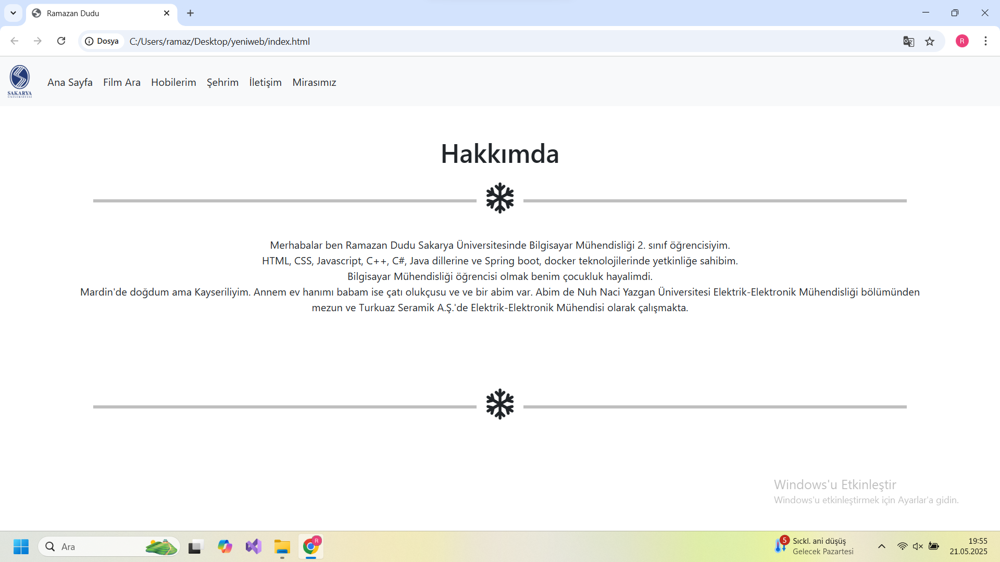
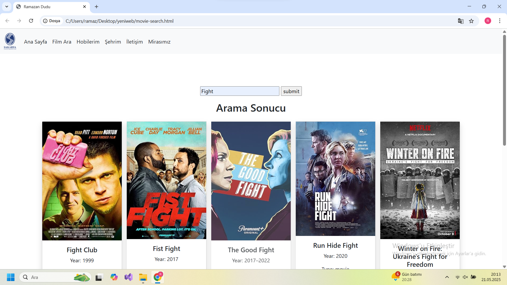
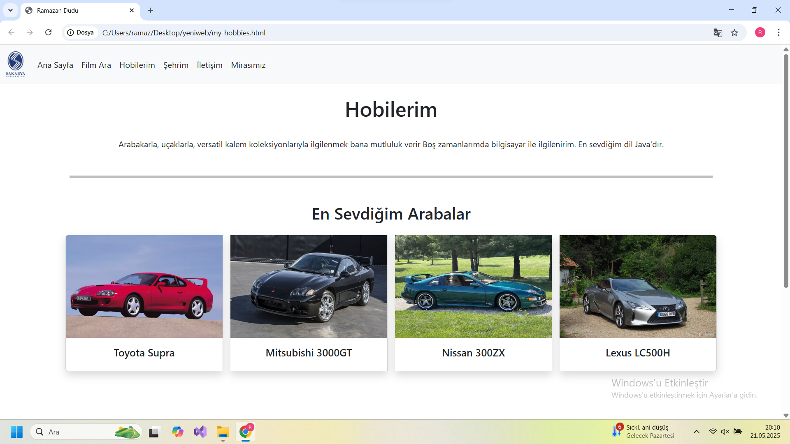
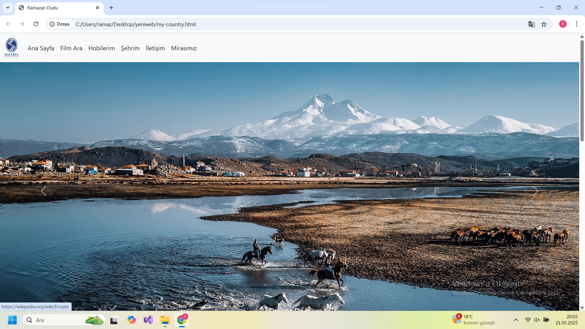
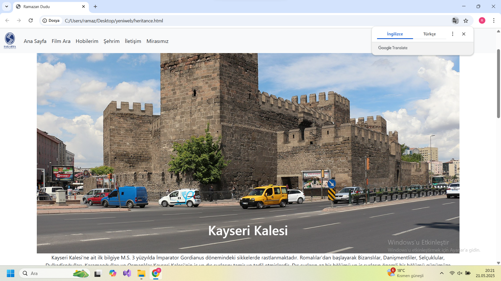
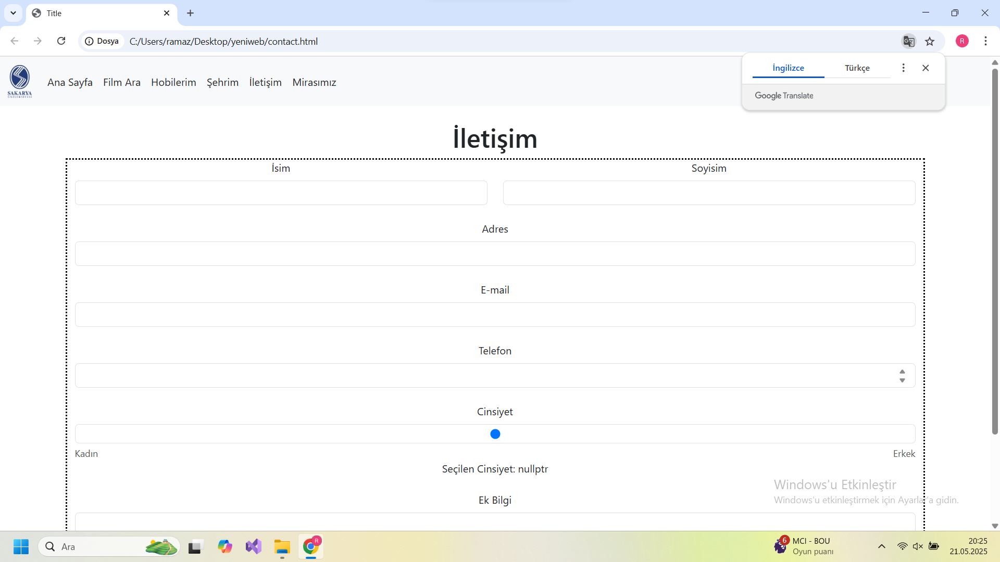
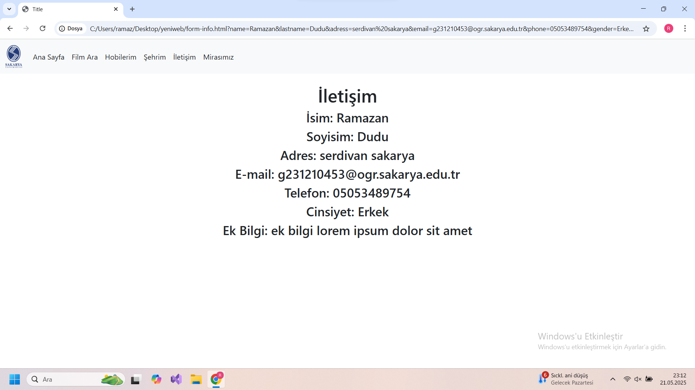
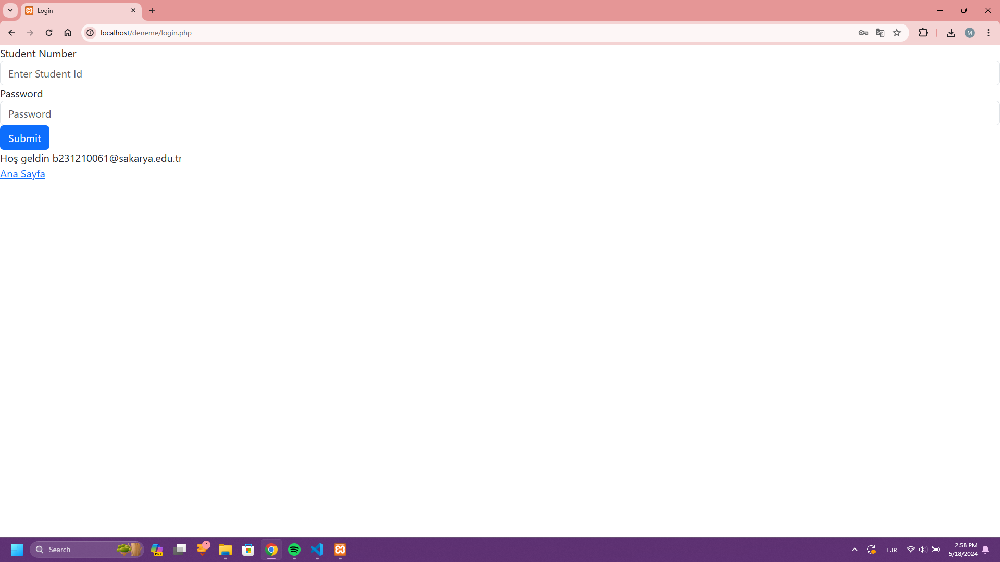

#        			      SAKARYA ÜNİVERSİTESİ							 
##			          BİLGİSAYAR VE BİLİŞİM FAKÜLTESİ   BİLGİSAYAR MÜHENDİSLİĞİ   WEB TEKNOLOJİLERİ   PROJE ÖDEVİ						
				 ÖĞRENCİ.............: RAMAZAN DUDU			
				 ÖĞRENCİ NUMARASI....: G231210453				
				 ÖĞRENCİ GRUBU.......:2.öğretim A GRUBU					

### Web Adresleri:
http://127.0.0.1/web-project/
 

### GitHub Repository:

https://github.com/ramazandudu/web-project

### Yaşanan Sıkıntılar:

<ul>
    <li>Web Hosting Sitesine Erişim ve SSL Sertifikası Sorunu</li>
	<li>Projenin İlk Haftalarında  https://tr.000webhost.com/ Sitesinden Ücretsiz Domain Alıp Ödevimi Bu Adrese https://g2312104553.000webhostapp.com/ Upload Ettim Lakin 18 Mayıs Tarihinde Siteye Eduroam ve Sau.net ile Girmeyi Deneyince SSL Hatasından Dolayı Siteye Erişim Sorunu Yaşamaya Başladım ve Site Üzerinde Ne FTP Ne de Kendi Dahili Dosya Yöneticisine Bağlanamadım</li>
	<li>https://profreehost.com/ ve https://www.infinityfree.net/ Sitesinden Domain Alıp Ödevimi Yüklediğim Zaman ise Alakasız Sitelere Yönlendiriyor Kendi Siteme Girmiyor</li>
    <li>React Frameworkü ve GIT Kayıtları ile Dosya Boyutu 82 megabayta ulaştı. Bundan Dolayı Ödev Dosyasında Node Modülleri ve .git Dizini Kaldırılarak Eklendi</li>
	<li>React CDN ile HTML Dosyasına Bağlandı Lakin Birebir Aynı Javascript Kodu kullanıldı Anlamsız Bir Kullanım Ortaya Çıktı</li>
</ul>

### Ekran Görüntüleri
## Index.html

<ul>
	<li>Kendimden Kısaca Bahsettim</li>
</ul>
 

## Movie-search.html

 
<ul>
	<li>API Kullanılarak Film Arama Ekranı Eklendi</li>
	<li>Ekranda Görüntülenen Filmlerin Üstüne Tıklayınca İlgili IMDB Sayfasına Yönlendirme Eklendi</li>
</ul>

## My-hobbies.html

 
<ul>
	<li>Hobilerimi Kısaca Anlattım</li>
	<li>İlgimi Çeken Arabalar ve Kalemler Bootstrap Kartı Olarak Eklendi ve Tıklanma Durumunda İlgili Wikipedia Sayfasına Yönlendirme Yapıldı</li>
</ul>

## My-Country.html

 
<ul>
	<li>Kendi Şehrim Hakkında Kısaca Bir Özet Yapıldı</li>
	<li>Bootstrap Carousel İçerisine 4 Adet Resim Eklendi ve Tıklanınca İlgili Sayfalara Yönlendirmesi Yapıldı</li>
	<li>Şehrimdeki Ünlü Yemekler Özetlendi ve Tıklanınca İlgili Wikipedia Sayfasına Yönlendirme Yapıldı</li>
</ul>

## Heritance.html

 
<ul>
	<li>Kayseri Kalesi Hakkında Bilgiler Eklendi</li>
</ul>

## Contanct.html

 
<ul>
	<li>İletişim Sayfası Eklendi ve Kullanıcı Hakkında Gerekli Bilgilerin Alındığı Bir Form Eklendi</li>
	<li>Normal Bir Şekilde Javascript ile Gönderme ve React ile Gönderme Butonları Eklendi</li>
	<li>Gönderildikten Sonra Gerekli Bilgiler Kontrol Eden Yapı Kuruldu</li>
	<li>Ayrıca Bu Sayfa React İle Live Server Üzerinden De Yapıldı Yani 3 Farklı Durumda Form Gönderme İşlevi Var</li>
	<li>Form Gönderildikten Sonra Form-info.html Sayfasına O Bilgileri Ekrana Yazdıran Kod Eklendi</li>
</ul>

## Form-info.html

 
<ul>
	<li>Formdan Gönderilen Bilgiler Listeyen Sayfa eklendi</li>
</ul>

## Login.php

 
<ul>
	<li>Login İşlemi Yapılması İçin Basit Form Eklendi</li>
	<li>Kullanıcı Adı g231210453, Şifresi ise g231210453 Olarak Ayarlandı</li>
</ul>
